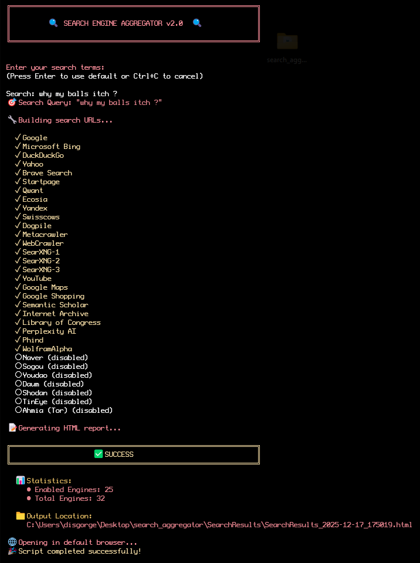

### ==Functionality==

  ✅ Proper search URL construction for each engine

  ✅ User input prompts for search terms

  ✅ Actual working URL encoding and parameter handling

  ✅ Support for custom URL templates

### ==Configuration==

  ✅ Easy engine management: Each engine has QueryParam (like "q" or "search") for automatic URL building
  
  ✅ Custom URL support: Some engines (like Google Maps) use special URL patterns
  
  ✅ Enable/Disable toggle: Simple Enabled = $true/$false for each engine
  
  ✅ Categorized engines: General, Meta, Privacy, Academic, AI-powered, International, etc.

### ==Beautiful Modern HTML Output==

  ✅ Gradient header design

  ✅ Card-based layout with hover effects

  ✅ Statistics dashboard

  ✅ Quick action buttons: "Open Top 5", "Open Top 10", "Open All"

  ✅ Responsive design for mobile devices

  ✅ Clean, professional styling

### =User Experience==

  ✅ Interactive banner and prompts

  ✅ Progress indicators

  ✅ Color-coded status messages

  ✅ Summary statistics

  ✅ Auto-opens in browser

### 📝 How to Use

  1. Run the script: Just double-click or run in PowerShell with ```.\search_aggregator.ps1```
  2. Enter search terms when prompted
  3. View results: HTML page opens automatically with all search links
  4. Click buttons to open searches in multiple engines at once

### ⚙️ Easy Customization

#### Add a New Search Engine:

  powershell
  
```@{ Name = "Your Engine"; BaseURL = "https://example.com/search"; QueryParam = "q"; Enabled = $true }```

---

### For Special URL Patterns:

  powershell
  
```@{ Name = "Special Engine"; CustomURL = "https://example.com/search/{query}/results"; Enabled = $true }```

---

### Modify Settings:

The ```$Config``` section lets you control:

- Output directory
- Auto-open browser
- Verbose output
- Default search terms

---

#### Terminal screenshot



#### Search results screenshot


